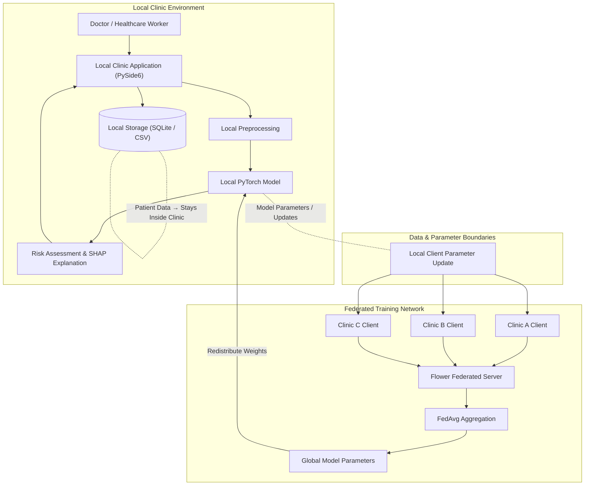

# Federated-Learning Diagnostic Co-Pilot

A privacy-focused, offline-first clinical decision-support prototype designed for low-connectivity healthcare clinics. The system enables localized diagnostic inference and collaborative model improvement across multiple clinics using federated learning, keeping raw patient data entirely on-site.

## Problem

Small and regional healthcare clinics in low-resource or Tier-2/3 settings face significant operational challenges:

* **Specialist Availability**: Limited access to specialized diagnostic expertise on-site.
* **Connectivity Barriers**: Intermittent or absent internet connectivity rendering cloud-dependent AI tools unusable.
* **Data Privacy Constraints**: Regulatory and ethical prohibitions against transmitting raw patient records to external cloud servers.
* **Limited Local Data**: Individual clinics handle relatively small patient volumes, making it difficult to train accurate local diagnostic models independently.

Combining offline local inference with federated synchronization addresses these constraints. Clinics operate autonomously for daily patient evaluations while participating in periodic federated training rounds to benefit from a broader, aggregated global model.

## Core Idea

```text
Clinic A ──┐
Clinic B ──┼──→ Federated Server → FedAvg → Global Model
Clinic C ──┘
```

The core architecture decouples clinical inference from centralized data aggregation:

* **Data Isolation**: Each clinic retains its patient records exclusively on local storage.
* **Uniform Architecture**: All participating clinics share an identical neural network structure.
* **Local Training**: Model training takes place on-site using the clinic's local dataset.
* **Parameter Exchange**: Clinics transmit model parameters—specifically learned weights and biases—to the federated coordinator instead of raw patient records.
* **Federated Aggregation**: The server aggregates parameter updates from all participating clinics using Federated Averaging (FedAvg).
* **Global Model Redistribution**: The updated global parameters are returned to participating clinics, updating their local decision-support models.

## Key Features

* **Offline-First Inference**: The local clinic application performs real-time diagnostic risk evaluations without requiring active internet connectivity.
* **Federated Learning**: Multiple healthcare facilities collaboratively train a shared neural network without centralizing raw datasets.
* **Local Data Storage**: Patient records remain strictly within the clinic network infrastructure.
* **Risk-Oriented Assessment**: Outputs risk scores and priority tiers to assist clinical decision-making rather than attempting automated definitive diagnoses.
* **Explainable AI**: Integrates feature attribution techniques (such as SHAP) to highlight key clinical indicators contributing to risk scores.
* **Multi-Clinic / Non-IID Data Handling**: Designed to accommodate heterogeneous (non-IID) patient demographic distributions across different clinic locations.
* **Privacy-Focused Architecture**: Minimizes privacy exposure by eliminating raw data transfers. *Note: Federated learning reduces data centralization risks but does not guarantee total privacy on its own; production environments require additional privacy measures such as differential privacy or secure aggregation.*

## System Architecture



The system strictly demarcates the **local inference path** from the **federated training path**:

* `Patient Data → stays inside clinic`
* `Model Parameters/Updates → Federated Server`

## Federated Learning Workflow

A single federated training round operates as follows:

1. The Flower server holds the current global model parameters.
2. The global model is distributed to all participating clinic clients.
3. Each clinic trains the model locally using only its own dataset.
4. Each clinic computes updated model parameters (weights and biases).
5. Updated parameters are transmitted to the Flower server.
6. The server aggregates parameter updates using Federated Averaging (FedAvg).
7. The newly aggregated global model parameters are redistributed back to participating clinics.

## Technology Stack

| Layer | Technology | Status / Intended Purpose |
| :--- | :--- | :--- |
| ML Model | PyTorch | Neural-network model definition, training, and local inference |
| Federated Learning | Flower | Client/server orchestration and parameter transmission |
| Aggregation | FedAvg | Federated Averaging algorithm for weight aggregation |
| Desktop App | PySide6 | Local desktop user interface for clinicians |
| Local Database | SQLite / CSV | On-site patient data and diagnostic log storage |
| Explainability | SHAP / Feature Importance | Attribution of input features to predicted risk scores |
| Packaging | PyInstaller / Docker | Standalone application packaging and environment reproducibility |

*Note: The technologies listed above reflect the planned architecture for this repository structure.*

## Project Structure

```text
federated-diagnostic-copilot/
├── data/
│   ├── clinic_A.csv
│   ├── clinic_B.csv
│   └── clinic_C.csv
├── models/
│   └── model.py
├── clinic/
│   ├── client_A.py
│   ├── client_B.py
│   └── client_C.py
├── federated/
│   └── server.py
├── app/
│   └── app.py
├── requirements.txt
└── README.md
```

### Folder and File Overview

* **`data/`**: Stores separate CSV files representing local, isolated patient records for individual clinics (`clinic_A.csv`, `clinic_B.csv`, `clinic_C.csv`).
* **`models/`**: Contains `model.py`, defining the PyTorch neural network architecture shared across all clients.
* **`clinic/`**: Contains client scripts (`client_A.py`, `client_B.py`, `client_C.py`) that handle local training loops and parameter communication with the server.
* **`federated/`**: Contains `server.py`, which initializes the Flower federated server and executes FedAvg aggregation.
* **`app/`**: Contains `app.py`, providing the desktop interface for local clinical decision support.
* **`requirements.txt`**: Specifies Python package dependencies required for the project.
* **`README.md`**: Technical overview and documentation for the project.

